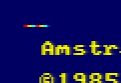
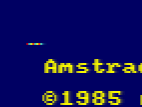
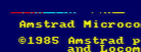

# RETO 1.P08: Domina el formato
Copia más abajo tus programas, cada uno en su parte del reto.

# PROGRAMAS

## Actividad 1: 4 Píxeles Rojos
```
3E FF 32 00 C0 18 FE
```
PC: 4000

## Actividad 2: (C) 24 Píxeles en grupos de 4 del mismo color
```
21 FF F0 22 00 C0 21 0F F0 22 02 C0 21 0F FF 22 04 C0 18 FE
```
PC: 4000

## Actividad 3: (C) 12 Píxeles en grupos de 2 del mismo color
```
3E FC 32 00 C0 21 3F C3 22 01 C0 18 FE
```
PC: 4000

## Actividad 4: (C) 8 Píxeles, de colores distintos
```
21 BD 6B 22 00 C0 18 FE
```
PC: 4000
## Actividad 5: (CC) Patrón libre de color de al menos 80 píxeles
```
21 FF FF 22 00 C0 21 FF 7F 22 02 C0 21 FF 7F 22 04 C0 21 3F 3F 22 06 C0 21 0F 0F 22 08 C0 21 0F 07 22 0A C0 21 0F 07 22 0C C0 21 03 03 22 0E C0 21 00 00 22 10 C0 21 00 80 22 13 C0 21 00 80 22 15 C0 21 C0 C0 22 17 C0 21 F0 F0 22 19 C0 3E F0 32 1B C0 18 FE
```
PC: 4000

# IMAGENES




